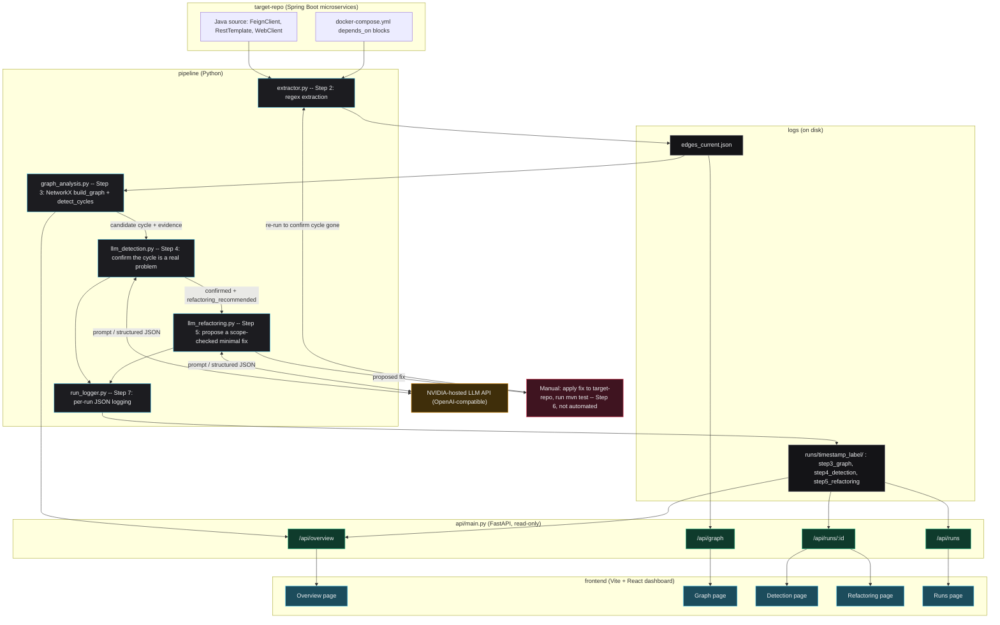

# Project Overview

## LLM-Guided Microservice Cyclic Dependency Detection & Autonomous Refactoring

This is a thesis research prototype. It detects the **Cyclic Dependency** architectural
smell across a Java Spring Boot microservices repository using static analysis (regex
extraction + graph cycle detection), asks an LLM to confirm the finding is a genuine
architectural problem and explain why, asks a second LLM call to propose a minimal
scope-limited fix, and logs every stage's full input/output for reproducibility. A
read-only dashboard visualizes all of it. Phase 1 scope, per `CLAUDE.md`: one smell, one
repository, no orchestration framework, manual patch application.

This document describes **what exists today** and how the pieces actually connect. For the
phased build plan and rationale, see `CLAUDE.md`. For step-by-step status and setup
instructions, see `README.md`.

---

## What is actually happening, end to end

### 1. The target repository

[`spring-petclinic-microservices`](https://github.com/spring-petclinic/spring-petclinic-microservices)
is cloned into `target-repo/` (gitignored — it's an external repo with its own `.git`, not
part of this project's history). It has 8 Spring Boot services. A synthetic, clearly-labeled
cyclic dependency was deliberately introduced between `customers-service` and
`visits-service` (documented in `target-repo/FIXTURE_NOTES.md`) so that Phase 1 has
something real to detect.

### 2. Extraction (`pipeline/extractor.py`)

Scans every top-level Maven module's Java source with regex (no AST parsing, per scope) for
`@FeignClient(...)`, `DiscoveryClient.getInstances("...")`, and any
`"http(s)://<service-name>/..."` string literal (covers `RestTemplate` and `WebClient`
calls), plus `docker-compose.yml` `depends_on` blocks as a secondary, lower-confidence edge
source. Output is a flat JSON list of `{caller, callee, source, file, line, evidence}`
records.

```
python -m pipeline.extractor target-repo -o logs/edges_current.json
```

### 3. Graph construction & cycle detection (`pipeline/graph_analysis.py`)

Loads the edge list into a `networkx.DiGraph` (`build_graph`, collapsing duplicate
caller/callee pairs but keeping all underlying evidence), then runs `nx.simple_cycles`
(`detect_cycles`). `docker-compose` edges are excluded from cycle detection by default —
they encode container startup order, not request-flow coupling. `cycle_evidence()` maps a
detected cycle back to the exact file/line evidence for each hop, which feeds the next step.
This step has no CLI of its own in normal use — steps 4 and 5 call it internally.

### 4. LLM Detection Agent (`pipeline/llm_detection.py`)

For every candidate cycle found in step 3, makes one LLM call (NVIDIA's OpenAI-compatible
endpoint, not the Claude API — see the module's provider note) grounded in the real code
evidence for each hop, requesting structured JSON: `detected`, `confidence`, `severity`,
`rationale`, `refactoring_recommended`. Includes a JSON-repair/retry loop
(`pipeline/json_utils.py`) for malformed responses.

```
python -m pipeline.llm_detection logs/edges_current.json --repo-root target-repo
```

### 5. LLM Refactoring Agent (`pipeline/llm_refactoring.py`)

Internally re-runs steps 3 and 4, then — for every cycle the detection agent confirmed and
recommended a fix for — makes a second LLM call proposing the **minimal** change that breaks
it: affected files, per-file changes (method/class + description), rationale, expected
impact. A **scope-enforcement check** rejects and re-prompts (bounded retries) if the plan
names any file outside the services participating in the cycle.

```
python -m pipeline.llm_refactoring logs/edges_current.json --repo-root target-repo
```

Running this one command is enough to exercise steps 3, 4, and 5 in one pass — there is no
separate orchestrator (`run_pipeline.py` doesn't exist yet).

### 6. Manual apply & verify — not yet automated

Applying the proposed fix to `target-repo`, re-running `mvn test`, and re-running the
extractor/cycle-detector to confirm the cycle disappeared is currently a manual step. This
is Phase 1's explicit final accept/reject gate and the next piece of the loop to close.

### 7. Logging (`pipeline/run_logger.py`)

Every `RunLogger` instance creates one timestamped directory under `logs/runs/`
(`<UTC-timestamp>_<label>/`) and writes one JSON file per stage into it (full prompts, raw
LLM responses, chain-of-thought reasoning, parse/scope-check status included) — this is what
makes a run reproducible and auditable after the fact.

### 8. The dashboard (read-only, doesn't trigger any of the above)

- **`api/main.py`** is a small FastAPI layer that reads `logs/edges_current.json` and
  `logs/runs/*/*.json` off disk, reusing `pipeline.graph_analysis` directly (rather than
  re-deriving cycle detection in JavaScript) to serve a live-recomputed graph/cycle view.
  Run: `python -m uvicorn api.main:app --reload --port 8000` (from the repo root).
- **`frontend/`** is a Vite + React + TypeScript SPA that renders that data: an interactive
  SVG dependency graph, the detection verdict and refactoring proposal with their full
  reasoning traces, and the run history. Run: `npm run dev` from `frontend/`, then open
  `http://localhost:5173`.
- Nothing in the dashboard invokes steps 2-5 — it's a viewer over whatever is already on
  disk. Adding a "run the pipeline" trigger is a natural next step once
  `run_pipeline.py` exists.

---

## Architecture diagram



---

## Repository map

```
pipeline/         Steps 2, 3, 4, 5, 7 -- extractor, graph analysis, LLM agents, logging
api/              Step 8 (dashboard backend) -- read-only FastAPI layer over logs/
frontend/         Step 8 (dashboard frontend) -- Vite + React + TypeScript SPA
tests/            pytest suite, one file per pipeline module
target-repo/      cloned target repo (gitignored, not part of this project's git history)
logs/             edges_current.json (latest extraction) + runs/ (per-run stage logs)
IGNORE/           reference docs only (the PRD) -- never commit generated output here
CLAUDE.md         phased implementation guide (Phase 1 steps, Phase 2+ roadmap)
README.md         status table, setup instructions, current known issues
```

## Known gaps (see `README.md` for full detail)

- `detect_cycles()` returns a cycle starting at whichever node NetworkX's traversal hits
  first, not a canonicalized rotation — the same cycle can print as `A -> B -> A` or
  `B -> A -> B` across runs.
- The synthetic cyclic-dependency fixture on `target-repo` exists only as uncommitted local
  changes; it isn't yet exported as a reproducible patch file.
- No single command chains steps 2 through 7 (though `llm_refactoring.py` alone already
  covers steps 3-5).
- The dashboard is read-only; it doesn't yet trigger new pipeline runs.
